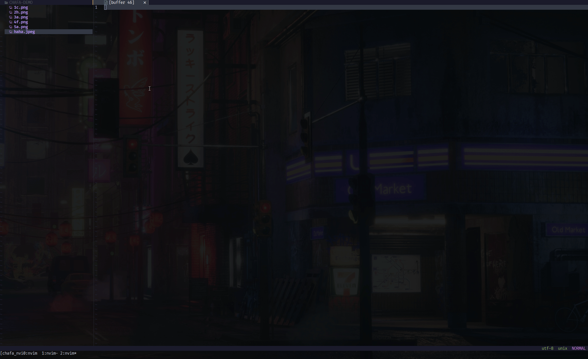

# chafa.nvim

A neovim plugin for viewing images.



> This plugin uses [chafa](https://github.com/hpjansson/chafa) under the hood to convert images to an output that can be printed in a terminal. It then uses [baleia](https://github.com/m00qek/baleia.nvim) to colorize text with ANSI escape sequences

## Prerequisites

- Install [chafa](https://github.com/hpjansson/chafa) and make sure it is in your path
- Neovim 0.7+

## Installation

```lua
use {
  "princejoogie/chafa.nvim",
  requires = {
    "nvim-lua/plenary.nvim",
    "m00qek/baleia.nvim"
  },
}
```

## Setup

```lua
require("chafa").setup({
  render = {
    min_padding = 5,
    show_label = true,
  },
  events = {
    update_on_nvim_resize = true,
  },
})
```

## User Commands

This plugin creates a `ViewImage` user command which you can manually call in svg files to view them in a separate buffer.


